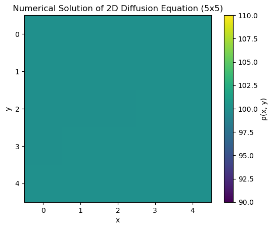
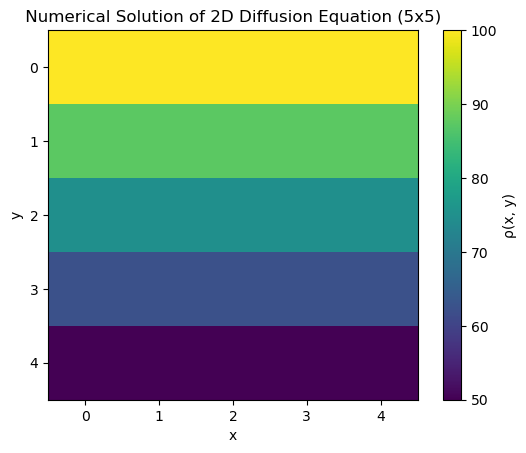
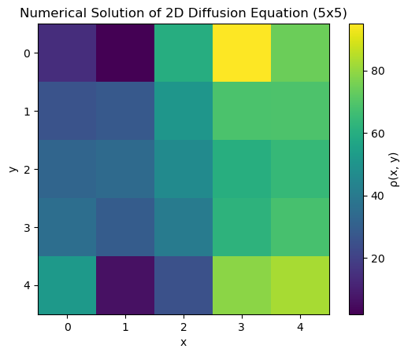
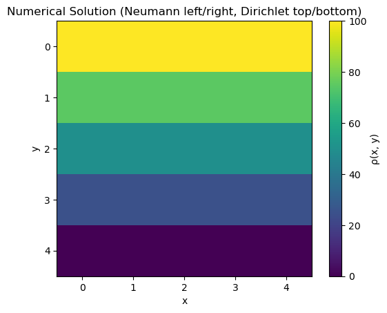
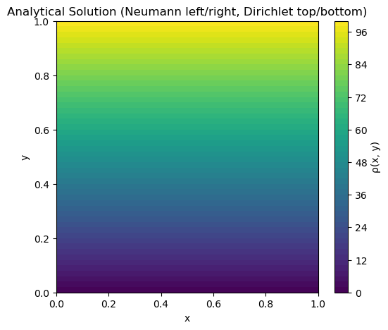
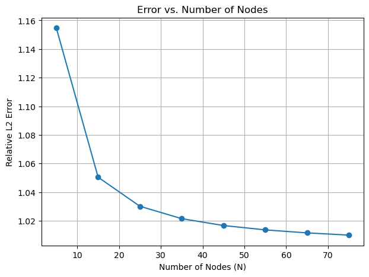
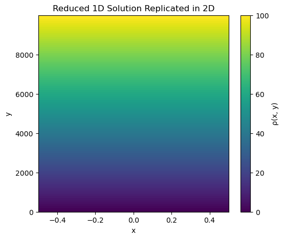
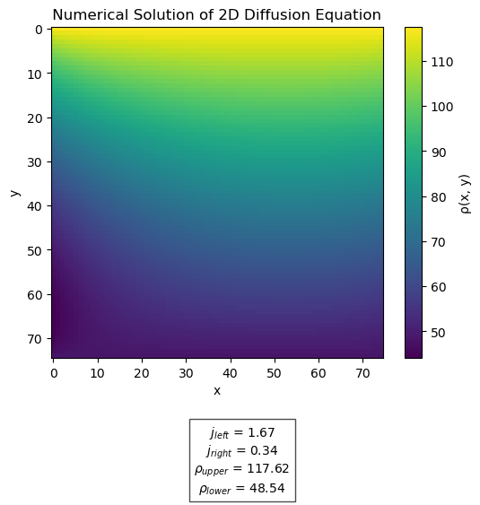
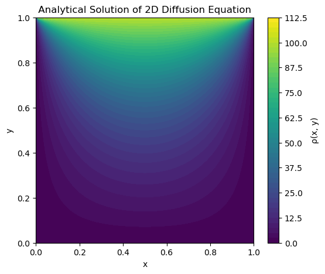
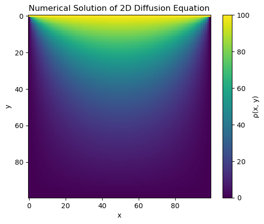

# 2D Steady-State Diffusion — Finite Difference Method

**Course:** Materials Simulation Practical | FAU Erlangen-Nürnberg  
**Tools:** Python · NumPy · Matplotlib

💻 [Notebook (report + code)](diffusion_pde_fdm.ipynb)

---

## Overview

Finite-difference formulation of the steady-state anisotropic diffusion equation in 2D. The notebook covers the full derivation from Fick's second law, analytical transformation to the isotropic Laplace form, second-order discretisation on structured grids, and assembly of the global linear system with block-tridiagonal sparsity. Seven test problems are solved under varying boundary configurations and grid resolutions, with convergence validated against an analytical Fourier-series reference solution.

---

## Governing Equation & Analytical Transformation

Starting from Fick's second law, the stationary anisotropic diffusion equation is reduced to a generalised Laplace equation by introducing the anisotropy ratio $P = D_{yy}/D_{xx}$:

$$\partial^2_{xx}\rho + P\,\partial^2_{yy}\rho = 0$$

A coordinate rescaling $\tilde{y} = y/\sqrt{P}$ maps this to the standard isotropic Laplace equation, absorbing the anisotropy coefficient and clarifying how diffusion asymmetry stretches the solution domain.

---

## Finite Difference Discretisation & System Assembly

The domain is discretised on a uniform $N_x \times N_y$ grid. Second-order central differences are applied in both directions, yielding a five-point stencil at each interior node. Grid nodes are mapped to a global index vector and the system is assembled into the linear form $\mathbf{C}\,\vec{\rho} = \vec{b}$, where $\mathbf{C}$ exhibits a block-tridiagonal sparsity pattern — each block corresponds to one grid row, with off-diagonal blocks encoding the $y$-direction coupling.

Dirichlet conditions (prescribed concentration) are imposed on the top and bottom boundaries. Neumann conditions (prescribed flux) are imposed on the left and right boundaries via ghost-node elimination, modifying the corresponding rows of $\mathbf{C}$ and entries of $\vec{b}$ without introducing additional unknowns.

---

## Test Problems — Boundary Condition Variants

Three baseline cases are solved on the coarse 5×5 grid to verify the solver under different Dirichlet configurations. Test 1 uses symmetric equal-valued top and bottom boundaries, producing a spatially uniform field. Test 2 applies uniform but asymmetric Dirichlet values, recovering the expected horizontal-band gradient. Test 3 assigns randomised per-node boundary values, confirming solver generality under non-uniform conditions.

<table>
  <tr>
    <td align="center"></td>
    <td align="center"></td>
    <td align="center"></td>
  </tr>
  <tr>
    <td align="center">Test 1 — symmetric Dirichlet BCs, uniform field (5×5)</td>
    <td align="center">Test 2 — asymmetric Dirichlet BCs, horizontal gradient (5×5)</td>
    <td align="center">Test 3 — randomised per-node Dirichlet boundary values (5×5)</td>
  </tr>
</table>

---

## Numerical vs. Analytical Comparison

An analytical solution is derived for mixed boundary conditions — zero-flux Neumann on the left and right, Dirichlet on top and bottom. The numerical and analytical concentration fields are compared directly on the 5×5 grid, quantifying the discretisation error introduced by the coarse resolution.

<table>
  <tr>
    <td align="center"></td>
    <td align="center"></td>
  </tr>
  <tr>
    <td align="center">Numerical solution — mixed Neumann/Dirichlet BCs (5×5)</td>
    <td align="center">Analytical solution — same boundary configuration</td>
  </tr>
</table>

---

## Convergence Study

The relative L2 error between the numerical and analytical solutions is computed as a function of grid resolution ($N$ from 5 to 75 nodes per side). The error decreases monotonically with refinement, confirming the expected convergence behaviour of the second-order scheme, before saturating at the truncation level of the Fourier series used as reference.

<table>
  <tr>
    <td align="center"></td>
  </tr>
  <tr>
    <td align="center">Relative L2 error vs. grid resolution — monotonic convergence from N=5 to N=75</td>
  </tr>
</table>

---

## 1D Reduction & High-Resolution Validation

When lateral fluxes vanish ($j_{left} = j_{right} = 0$), the 2D problem reduces exactly to a 1D linear profile in $y$. This case serves as an exact verification test, confirming that the solver recovers the analytical linear gradient across the full domain. The full 2D solver is then run at 75×75 resolution with randomised Dirichlet and Neumann boundary values, demonstrating robustness under arbitrary boundary data.

<table>
  <tr>
    <td align="center"></td>
    <td align="center"></td>
  </tr>
  <tr>
    <td align="center">Test 6 — 1D linear reduction replicated in 2D</td>
    <td align="center">Test 7 — 75×75 grid, randomised mixed boundary conditions</td>
  </tr>
</table>

---

## Fourier Series Analytical Solution

A full Fourier sine-series solution is derived and evaluated for the isotropic Laplace equation with four-sided Dirichlet conditions, providing a high-resolution reference at 100×100 independent of the finite difference solver. The numerical solution at the same resolution is compared directly against this reference.

<table>
  <tr>
    <td align="center"></td>
    <td align="center"></td>
  </tr>
  <tr>
    <td align="center">Analytical Fourier series solution — four-sided Dirichlet BCs (100×100)</td>
    <td align="center">Numerical FDM solution — same configuration (100×100)</td>
  </tr>
</table>

---

## Requirements

```bash
pip install numpy matplotlib
```

---

## Usage

Open `diffusion_pde_fdm.ipynb` in Jupyter and run all cells sequentially. No external dataset is required — all grids and boundary conditions are generated within the notebook. Grid resolution and boundary values are defined at the top of each test problem section and can be modified directly.
